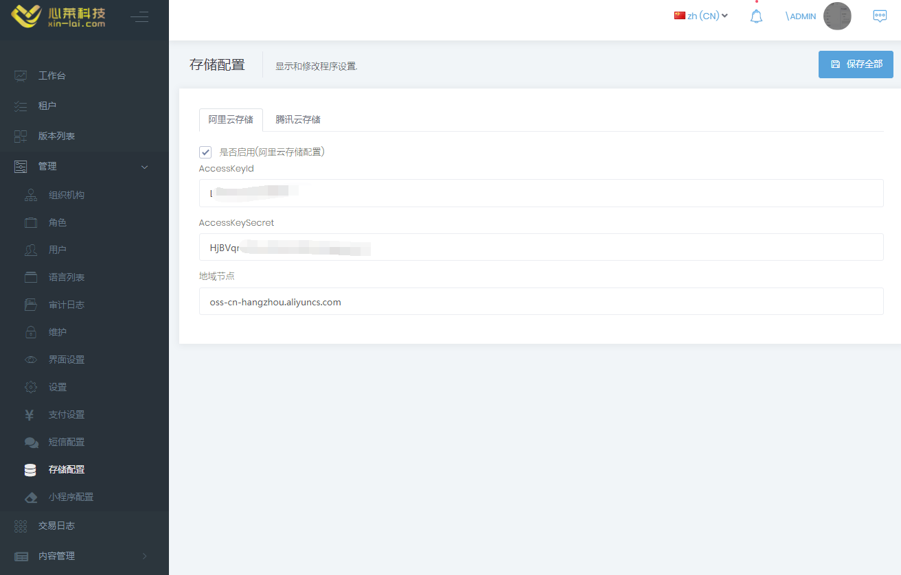
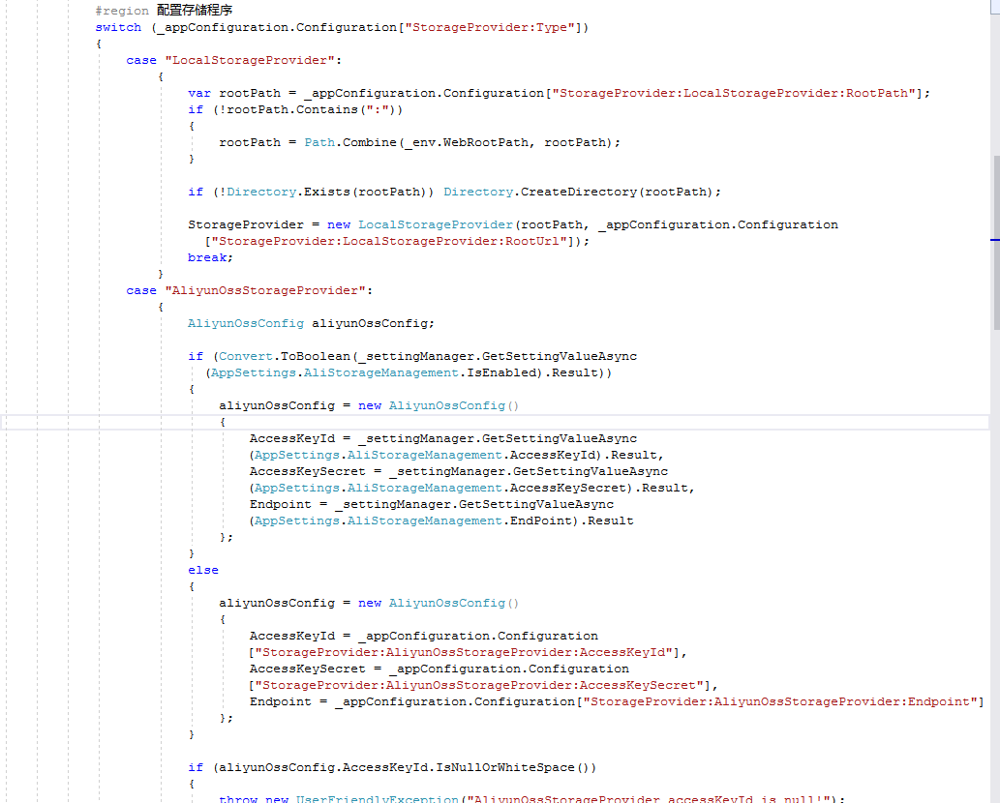
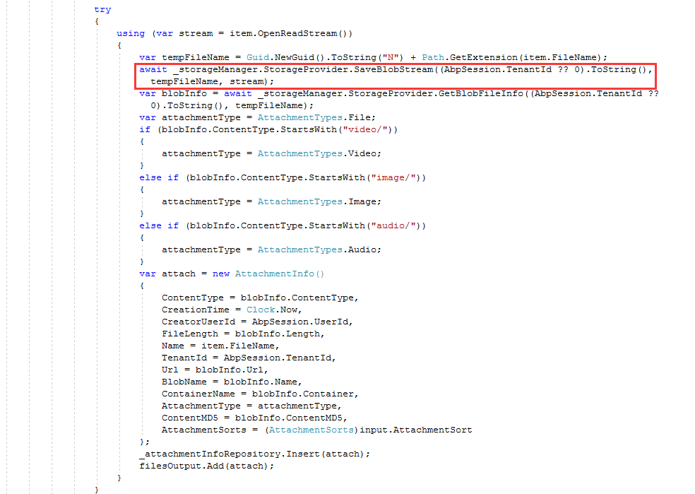
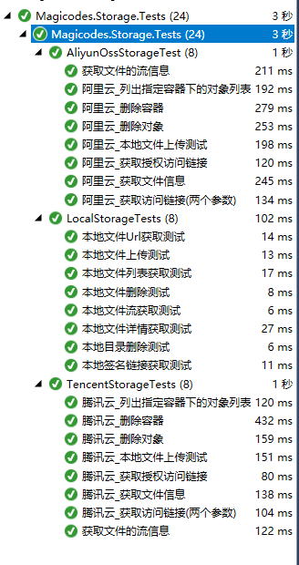

# Magicodes.Storage

## 说明
Magicodes.Storage，是心莱科技团队提供的统一存储库，相关库均使用.NET标准库（netstandard2.0）编写，支持.NET Framework以及.NET Core。

我们希望，使用了Magicodes.Storage之后，开发者可以很快的从本地存储切换到云端存储；我们希望，使用了Magicodes.Storage之后，开发者可以快速地从不同的云存储供应商之间切换。

目前主要支持以下存储：

* 本地存储（本地站点目录）
* 阿里云存储
* 腾讯云存储

## 相关Nuget包

| 名称     |      Nuget      |   说明 |
|----------|:-------------:|:-------------:|
| Magicodes.Storage.Core |  | 存储核心库 |
| Magicodes.Storage.AliyunOss.Core |  |阿里云OSS存储实现库 |
| Magicodes.Storage.Local.Core |  |本地存储实现库 |
| Magicodes.Storage.Tencent.Core |  |腾讯云COS存储实现库 |
| Magicodes.Storage.Abp.Core |  |腾讯云COS存储实现库 |

## 相关实践

我们围绕Magicodes.Admin开源库做了许多实践。如下图所示：

Magicodes.Admin开源库地址：https://gitee.com/xl_wenqiang/Magicodes.Admin.Core

## VNext

这是目前的下个版本的规划：

* 支持分块上传
* 支持存储桶的创建和删除
* 支持Azure存储
* 支持亚马逊存储
* 支持七牛云
* 阿里云的SDK包更新为官方的包(目前还存在问题)

具体功能我们会根据项目的情况来迭代，如果你有好的建议或者意见，可以关注我们的公众号“magiccodes”来提交您的意见或者意见。

## 如何配置

相关库的配置相对比较简单，一般均使用相关Builder类来配置自定义日志逻辑、配置获取逻辑等，具体可以查阅Builder目录下的代码。

### 配置参考

相关配置请参考此代码:https://gitee.com/xl_wenqiang/Magicodes.Admin.Core/blob/develop/src/unity/Magicodes.Unity/Storage/StorageManager.cs

部分代码如下所示：

使用代码可以参考:

具体链接：
<https://gitee.com/xl_wenqiang/Magicodes.Admin.Core/blob/develop/src/app/api/App.Host/Controllers/AttachmentController.cs>

## 单元测试：

## 官方订阅号

关注“magiccodes”订阅号免费获取：

* 最新文章、教程、文档
* 视频教程
* 基础版免费授权
* 模板
* 解决方案
* 编程心得和理念

## 相关QQ群

编程交流群<85318032>

产品交流群<897857351>

## 官方博客

<http://www.cnblogs.com/codelove/>

## 其他开源库地址

<https://gitee.com/xl_wenqiang/Magicodes.Admin.Core>
<https://github.com/xin-lai>

